# CareBridge

<div align="center">

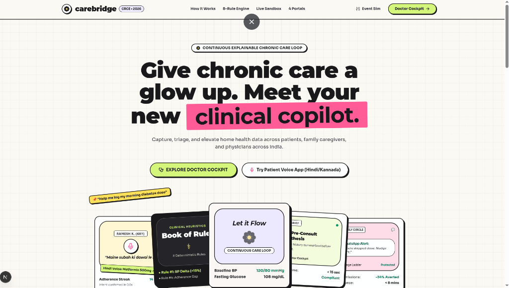

<br/><br/>

### Give chronic care a glow up. Meet your new clinical copilot.
**Continuous, explainable, closed-loop telemetry triage connecting patients, family caregivers, and physicians across India.**

[](https://nextjs.org/)
[](https://www.typescriptlang.org/)
[](https://tailwindcss.com/)
[](https://abdm.gov.in/)
[](https://developer.mozilla.org/en-US/docs/Web/API/Web_Speech_API)
[](https://jainuniversity.ac.in)

**Chenraj Roychand Centre for Entrepreneurship (CRCE) · Jain (Deemed-to-be University)**  
*Developed by Team **poweredbycaffine**: Swapnil (Lead / Product Architect) · Aman (Doctor Decision Support) · Vedesh (UI/UX & Accessibility) · Aryan (Backend & Risk Pipelines)*

> **Mandatory Regulatory Disclosure:** CareBridge is an outpatient clinical decision-support and triage companion. CareBridge does not autonomously diagnose medical conditions or alter drug dosages. **All clinical decisions remain with the treating physician. All prototype data is simulated for demonstration.**

---

### [Live Demo Landing](http://localhost:3000) · [Doctor Cockpit](http://localhost:3000/doctor/p1) · [Patient Mobile App](http://localhost:3000/patient) · [Family Feed](http://localhost:3000/family) · [Admin ROI](http://localhost:3000/admin) · [Simulator Console](http://localhost:3000/sim)

</div>

---

## Table of Contents
1. [Executive Summary & Core USP](#executive-summary--core-usp)
2. [Visual Walkthrough & Core Interfaces](#visual-walkthrough--core-interfaces)
   - [1. Comprehensive Care Circle Ecosystem](#1-comprehensive-care-circle-ecosystem)
   - [2. Continuous Telemetry & Doctor Cockpit](#2-continuous-telemetry--doctor-cockpit)
   - [3. Interactive Triage Sandbox & Hackathon Judge Panel](#3-interactive-triage-sandbox--hackathon-judge-panel)
   - [4. Clinical Clarity Pillars](#4-clinical-clarity-pillars)
   - [5. Elderly-First Patient Mobile App (Home, Meds & Vitals)](#5-elderly-first-patient-mobile-app-home-meds--vitals)
3. [The Problem vs The CareBridge Paradigm](#the-problem-vs-the-carebridge-paradigm)
4. [Validated Market Need & Clinical Evidence](#validated-market-need--clinical-evidence)
5. [System Architecture & Data Flow](#system-architecture--data-flow)
6. [The 3-Tier Escalation Ladder](#the-3-tier-escalation-ladder)
7. [Two-Way Closed-Loop Feedback Loop](#two-way-closed-loop-feedback-loop)
8. [The 8 Deterministic Clinical Heuristics](#the-8-deterministic-clinical-heuristics)
9. [Competitive Differentiation Matrix](#competitive-differentiation-matrix)
10. [Business Model & Unit Economics](#business-model--unit-economics)
11. [Tech Stack & Engineering Standards](#tech-stack--engineering-standards)
12. [2-Minute Live Demo Script](#2-minute-live-demo-walkthrough)
13. [Quick Setup & Local Execution](#getting-started-locally)
14. [Team & Incubation Support](#team--incubation-support)

---

## Executive Summary & Core USP

### The Problem: Wearables Show Numbers, But Explain Nothing
Modern smartwatches and fitness apps inundate users with raw numbers, isolated heart rate charts, and step graphs. 
- **Patients** don't understand what their raw numbers actually signify and abandon routines.
- **Doctors** see patients for just 10 minutes every few months, completely blind to the critical 90 days of telemetry in between.
- **Distant Families** worry constantly but only discover health deteriorations after an emergency hospital admission.

### The CareBridge Paradigm
**CareBridge transforms raw passive smartwatch telemetry into actionable clinical meaning through an intelligent, bidirectional closed-loop:**

```
Smartwatch Raw Telemetry  ──▶  Deterministic Anomaly & LLM Interpretation
                                              │
              ┌───────────────────────────────┴───────────────────────────────┐
              ▼                                                               ▼
   Doctor Clinical Cockpit                                         Family Guardian Feed
  (Triage Red-Queue, Citations,                                  (Plain-language peace of mind,
    What-If Drug Simulator)                                        missed-dose escalation)
              │
              ▼
   Doctor Updates Care Plan
              │
              ▼
   Bidirectional Sync: Patient Daily Goals & Voice Interface Update Automatically
```

1. **Passive Telemetry to Plain Language:** Translates nocturnal heart rate spikes (>100 bpm) and activity drops into plain language for elderly patients in **Hindi, Kannada, and Indian English**.
2. **Dual-Endpoint Delivery:** Routes clinical insights to the **Doctor's Triage Cockpit** and proactive alerts to the **Family Guardian Feed**.
3. **Two-Way Closed-Loop Feedback:** When the doctor updates medication or lifestyle targets, CareBridge automatically updates the patient's daily goals and tracks recovery compliance.

---

## Visual Walkthrough & Core Interfaces

### 1. Comprehensive Care Circle Ecosystem
<div align="center">
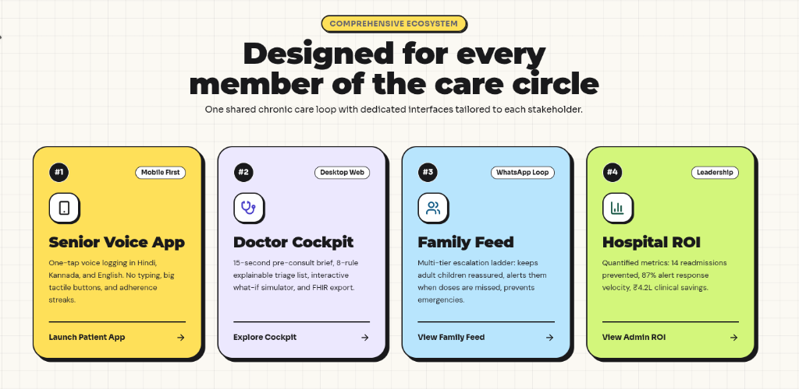
</div>

> **One Shared Chronic Care Loop Across 4 Specialized Stakeholder Portals:**
> - **#1 Senior Voice App (Mobile First):** One-tap speech logging in Hindi, Kannada, and English. No typing, oversized tactile buttons, and adherence streak celebration.
> - **#2 Doctor Cockpit (Desktop Web):** 15-second pre-consult brief, 8-rule explainable triage list, interactive What-If medication simulator, and ABDM FHIR R4 export.
> - **#3 Family Feed (WhatsApp Loop):** Multi-tier escalation ladder: keeps adult children reassured, alerts them when doses are missed, and prevents avoidable readmissions.
> - **#4 Hospital ROI (Executive Leadership):** Quantified metrics: 14 readmissions prevented per 100 monitored chronic patients, 87% alert response velocity, ₹6.3L direct clinical savings.

---

### 2. Continuous Telemetry & Doctor Cockpit
<div align="center">
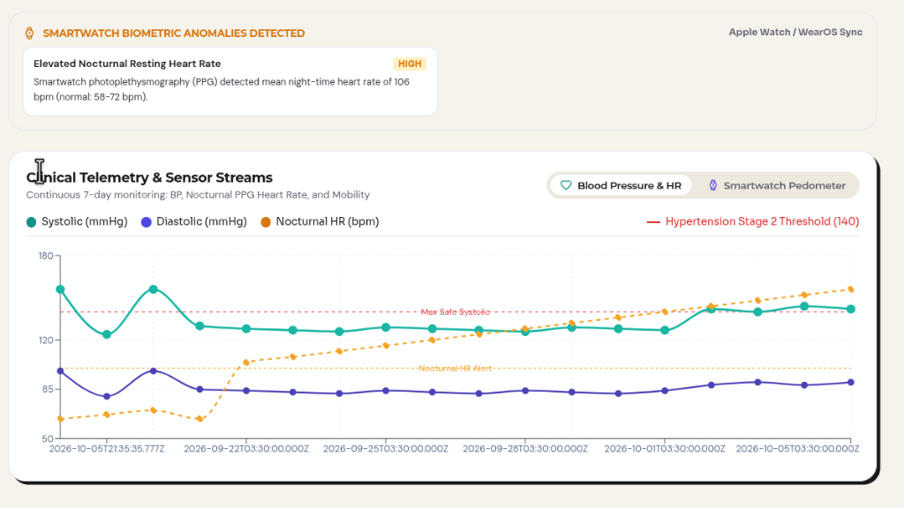
</div>

> **Smartwatch Biometric Anomalies & 7-Day Sensor Streams:**  
> The Doctor Cockpit continuously synthesizes blood pressure trajectories, nocturnal PPG heart rate, and step pedometer streams. It immediately flags high-severity physiological anomalies—such as an **Elevated Nocturnal Resting Heart Rate of 106 bpm** (normal: 58–72 bpm)—with real-time Apple Watch & WearOS synchronization.

---

### 3. Interactive Triage Sandbox & Hackathon Judge Panel
<div align="center">
<table>
<tr>
<td width="50%" align="center">
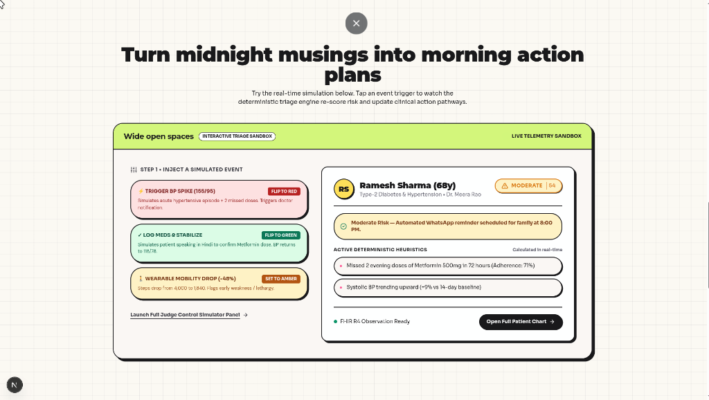
<br/><b>Live Telemetry Sandbox</b><br/>
<sub>Inject acute hypertensive spikes, missed doses, and mobility drops in real-time.</sub>
</td>
<td width="50%" align="center">
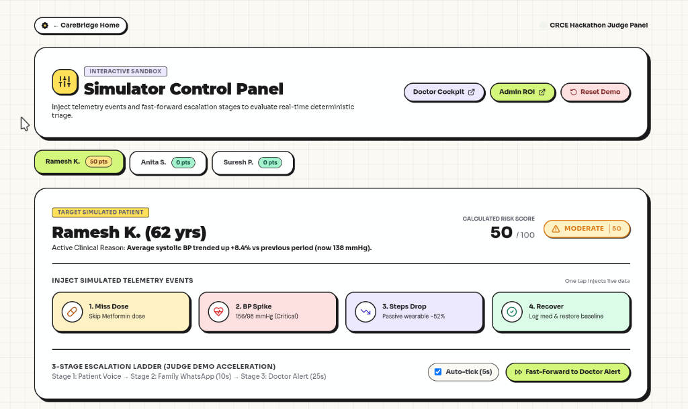
<br/><b>Judge Demo Acceleration Panel</b><br/>
<sub>Fast-forward the 3-stage escalation ladder and inspect live calculated risk scores (0–100).</sub>
</td>
</tr>
</table>
</div>

> **Turn Midnight Musings into Morning Action Plans:**  
> Designed specifically for clinical evaluators and hackathon judges to verify the determinism of CareBridge:
> - **1. Miss Dose:** Skips Metformin dose, triggers Stage 1 patient voice ping and Stage 2 family WhatsApp nudge.
> - **2. BP Spike (156/98 mmHg Critical):** Pushes calculated risk score to 50+ (Moderate/High), instantly escalating to clinic.
> - **3. Steps Drop (-52%):** Flags passive wearable frailty as daily steps fall drastically.
> - **4. Recover:** Patient logs medication by voice, returning telemetry to green baseline (118/78 mmHg).

---

### 4. Clinical Clarity Pillars
<div align="center">
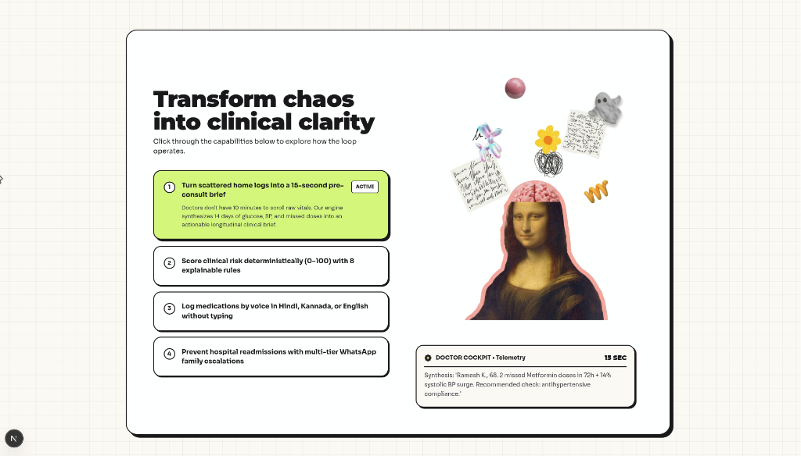
</div>

> **Transform Chaos into Clinical Clarity (The 4 Engine Pillars):**
> 1. **15-Second Pre-Consult Brief:** Synthesizes 14 days of glucose, BP, and missed doses into an actionable longitudinal clinical brief with verifiable citations (`[Obs: v7]`).
> 2. **Deterministic Risk Scoring (0–100):** Objective risk categorization across 8 explainable medical heuristics—never a black box.
> 3. **Multilingual Voice Logging:** Frictionless speech logging in **Hindi, Kannada, or English** without typing.
> 4. **Multi-Tier WhatsApp Family Escalation:** Progressive nudges prevent emergency readmissions before symptoms turn critical.

---

### 5. Elderly-First Patient Mobile App (Home, Meds & Vitals)

<div align="center">
<table>
<tr>
<td width="33%" align="center">
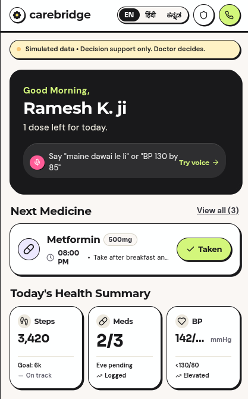
<br/><b>Patient Home Dashboard</b><br/>
<sub>High-contrast `#121214` hero card, voice prompt pill, and equalized summary tiles.</sub>
</td>
<td width="33%" align="center">
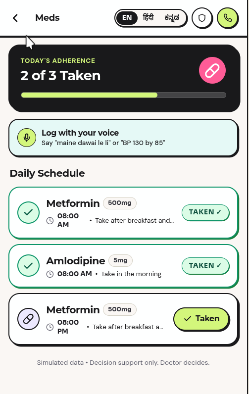
<br/><b>Daily Medication Schedule</b><br/>
<sub>Adherence tracker (`2 of 3 Taken`), voice logging hint, and high-contrast check buttons.</sub>
</td>
<td width="33%" align="center">
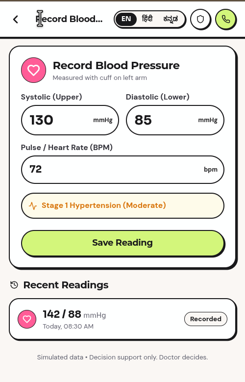
<br/><b>Blood Pressure Logging</b><br/>
<sub>Automatic classification (Stage 1 Hypertension Moderate) and recent historical trends.</sub>
</td>
</tr>
</table>
</div>

> **Tactile Senior-First Design:**
> - **High-Contrast Dark Greeting Hero Card:** Solid `#121214` ink background, `#D4F77C` fluorescent lime greeting, pure white heading, and integrated voice prompt pill with `#FF5C98` mic icon.
> - **3 Perfectly Aligned Metric Boxes:** Equalized height with non-overlapping responsive typography for Steps (`3,420`), Meds (`2/3`), and Blood Pressure (`142/88 mmHg`).
> - **Multilingual Localization:** Instant real-time language toggling across English (`EN`), Hindi (`हिंदी`), and Kannada (`ಕನ್ನಡ`).

---

## Validated Market Need & Clinical Evidence

<div align="center">
<table>
<tr>
<td width="33%" align="center">
<h3>51%</h3>
<b>Medication Non-Adherence</b><br/>
More than half of Indian chronic patients fail to follow daily prescriptions between clinic visits.<br/>
<i>(Source: WHO SAGE India Study)</i>
</td>
<td width="33%" align="center">
<h3>23.7 Crore</h3>
<b>Chronic Disease Burden</b><br/>
10.1 Crore diabetics and 13.6 Crore hypertensive individuals across India.<br/>
<i>(Source: Lancet ICMR-INDIAB Study, 2023)</i>
</td>
<td width="33%" align="center">
<h3>$1.37 Billion</h3>
<b>India RPM Market</b><br/>
Growing from $255M at a 20.5% CAGR as smartwatches and phones saturate Tier 1–3 cities.<br/>
<i>(Source: IMARC & MarketsandMarkets 2025)</i>
</td>
</tr>
</table>
</div>

### Market Size (TAM / SAM / SOM)
- **Total Addressable Market (TAM):** **23 Crore (230 Million)** individuals in India living with diabetes or hypertension.
- **Serviceable Available Market (SAM):** **3.5 Crore (35 Million)** urban seniors with smartphones whose healthcare is managed by working adult children.
- **Serviceable Obtainable Market (SOM):** Post-discharge cardiac and diabetic patients in private clinics across Bengaluru and Tier-1 metros.

---

## System Architecture & Data Flow

CareBridge is built on a clean, decoupled architecture with deterministic rule evaluation, grounded clinical citations, and zero-latency local fallback execution.

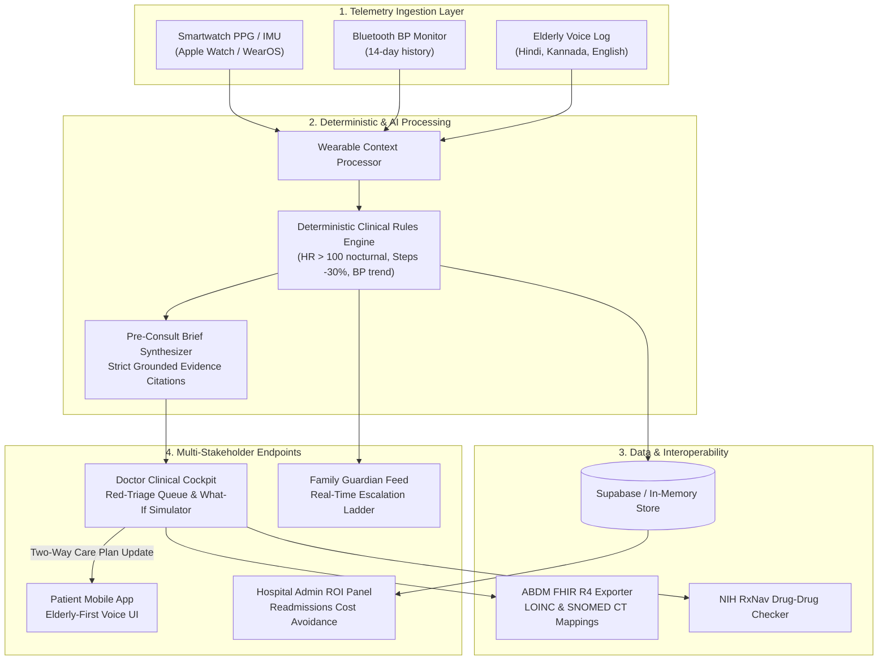

---

## The 3-Tier Escalation Ladder

Rather than overwhelming physicians with raw alert fatigue, CareBridge deploys a progressive, time-calibrated safety net:

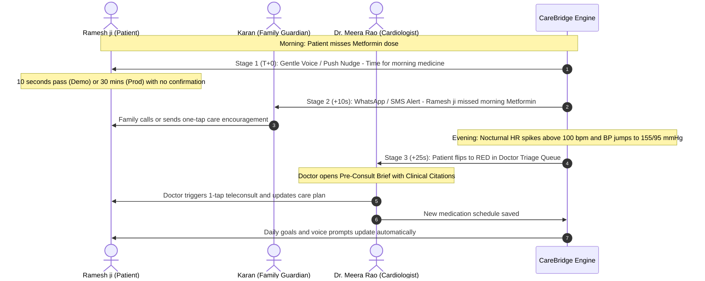

---

## Two-Way Closed-Loop Feedback Loop

The fundamental breakthrough of CareBridge is transforming outpatient care from a one-way monitoring stream into an **active bidirectional loop**:

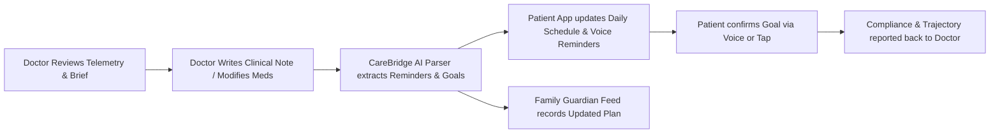

---

## The 8 Deterministic Clinical Heuristics

CareBridge never computes clinical risk scores with an unpredictable black-box LLM. Every triage score (0–100) is grounded in deterministic clinical rules:

| Rule Code | Clinical Rule Description | Trigger Threshold | Risk Points Added | Severity Tier |
|---|---|---|---|---|
| **RULE_BP_ACUTE** | Acute Hypertensive Crisis | Systolic $\ge 160$ or Diastolic $\ge 100$ mmHg | +35 pts | **CRITICAL (Red)** |
| **RULE_BP_TREND** | Systolic Baseline Drift | Systolic trending $\ge 10\%$ above 14-day baseline | +15 pts | **MODERATE (Amber)** |
| **RULE_MED_CRIT** | Critical Medication Non-Adherence | $\ge 2$ consecutive doses missed in 48h | +25 pts | **HIGH (Red)** |
| **RULE_MED_GAP** | General Medication Adherence Gap | 7-day adherence rate $< 75\%$ | +10 pts | **MODERATE (Amber)** |
| **RULE_HR_NOCTURNAL** | Elevated Nocturnal Resting Heart Rate | Mean sleep HR $> 100$ bpm across 2 nights | +20 pts | **HIGH (Amber/Red)** |
| **RULE_MOBILITY_DROP** | Acute Frailty / Mobility Drop | Pedometer steps drop $> 30\%$ vs 7-day moving avg | +15 pts | **MODERATE (Amber)** |
| **RULE_GLUCOSE_SURGE** | Postprandial Glucose Surge | Fasting glucose $> 160$ mg/dL or random $> 220$ | +20 pts | **HIGH (Red)** |
| **RULE_COMPOSITE** | Multi-Factor Escalation | Concomitant BP spike + missed anti-hypertensive | +15 pts bonus | **CRITICAL (Red)** |

---

## Competitive Differentiation Matrix

| Feature / Dimension | Traditional Telehealth (Practo, Apollo 24/7) | Consumer Wearables (Apple Watch, Fitbit) | CareBridge |
|---|---|---|---|
| **Primary Use-Case** | Episodic sick-care & appointment booking | Personal consumer fitness tracking | **Continuous post-discharge chronic care** |
| **Data Interpretation** | None (Raw PDF lab reports uploaded) | Graphs & numbers without clinical context | **Telemetry translated into plain-language clinical meaning** |
| **Clinical Endpoint** | Manual doctor consultation | Isolated on consumer's phone | **Risk-ranked triage dashboard with AI pre-consult briefs** |
| **Family Inclusion** | Isolated to individual patient account | Family cannot view or receive escalations | **Integrated family guardian escalation feed** |
| **Doctor-Patient Loop** | One-off appointment | One-way raw data export | **Two-way closed loop: Doctor changes sync patient goals** |
| **Accessibility** | English-centric, complex multi-step menus | English apps with dense charts | **Elderly voice UI in Hindi, Kannada, and English** |
| **Price Point** | High per-consultation fees (₹700 - ₹1,500) | Expensive hardware ($300 - $800) | **₹299 / month per elder subscription** |

---

## Business Model & Unit Economics

CareBridge operates a high-margin hybrid B2B/B2C healthcare subscription model:

```
                           ┌───────────────────────────────┐
                           │   CareBridge Monetization     │
                           └───────────────┬───────────────┘
                                           │
                 ┌─────────────────────────┴─────────────────────────┐
                 ▼                                                   ▼
       B2C: Family Subscription                            B2B: Clinic Outpatient SaaS
       ₹299 / month per elder parent                       ₹2,500 / month per doctor
     (Free 30-day post-discharge trial,                  (Includes monitoring up to 100 patients;
       converts to recurring auto-debit)                   lowers readmission penalties)
```

### Financial Model & Hospital Cost Avoidance
- **Average Cost of Avoidable Hospital Readmission (India):** ₹45,000 per episode (ICU stay, diagnostics, stabilization).
- **Readmissions Averted:** 14 readmissions averted per 100 monitored chronic patients over 6 months.
- **Direct Hospital / Family Savings:** **₹6,30,000 saved per 100 patients**.
- **Gross Margins:** **> 82%** (cloud compute & WhatsApp Business API costs are under ₹45/patient/month).

---

## Tech Stack & Engineering Standards

| Layer | Technologies & Implementations |
|---|---|
| **Frontend Framework** | **Next.js 14 (App Router)**, React 18, TypeScript (Strict Mode) |
| **Design Tokens & UI** | Custom Tailwind CSS tokens, Neobrutalist Warm-Paper aesthetic, SVG Line-Art |
| **Typography Standard** | Strictly 3 Google Fonts: **Montserrat** (Headings), **DM Sans** (Body/Tables), **Sora** (Numbers/Vitals) |
| **State & Persistence** | Supabase Postgres with Realtime + Zero-Config In-Memory Local Store Fallback |
| **Clinical Decision AI** | Multi-Factor Risk Scorer (8 deterministic heuristic rules) + Pre-Consult Brief Synthesizer |
| **Health Interoperability** | **ABDM FHIR R4 Bundle Exporter** with LOINC vitals and SNOMED CT condition codes |
| **Drug Safety Engine** | NIH RxNav REST API client with local deterministic 12-week recovery curves |
| **Voice & Localization** | Web Speech Recognition API with local regex intent parser (`hi-IN`, `kn-IN`, `en-IN`) |
| **Charts & Visualization** | Recharts (Responsive dual-axis line charts, reference alert lines) |

---

## 2-Minute Live Demo Walkthrough

When presenting to judges or clinical partners, execute this proven sequence using the built-in [Interactive Simulator](http://localhost:3000/sim):

1. **[0:00 - 0:25] Elderly Voice Logging:** Open [Patient App](http://localhost:3000/patient). Tap the microphone button and log medication in Hindi (*"Maine Metformin le li"*). Show instant confirmation and goal check-off.
2. **[0:25 - 0:50] The Incident & Escalation:** Open [Simulator](http://localhost:3000/sim). Click **"Simulate Missed Dose"**. Fast-forward 10 seconds. Switch to [Family Feed](http://localhost:3000/family) to view the real-time Level 2 family escalation alert.
3. **[0:50 - 1:20] Telemetry Anomaly & Doctor Triage:** On [Simulator](http://localhost:3000/sim), click **"Inject Nocturnal HR Spike (>100 bpm)"**. Switch to [Doctor Portal](http://localhost:3000/doctor). Watch Ramesh ji flip into the **RED High-Risk Queue**.
4. **[1:20 - 1:40] AI Pre-Consult Brief & What-If Simulator:** Open [Ramesh ji's Profile](http://localhost:3000/doctor/p1). Click **"Pre-Consult Brief"** to display grounded citations (`[Obs: v7]`). Click **"What-If Simulator"** to demonstrate adding SGLT2i with 12-week projected systolic recovery.
5. **[1:40 - 2:00] Two-Way Care Plan Update & Admin ROI:** Click **"Update Care Plan"** and submit a revised walk and dosage instruction. Show the patient app updating automatically. Switch to [Admin ROI](http://localhost:3000/admin) to demonstrate hospital readmission savings (₹6,30,000 saved).

---

## Getting Started Locally

### Prerequisites
- Node.js 18.17+ or 20+
- npm, pnpm, or yarn

### Quick Setup

```bash
# 1. Clone repository
git clone https://github.com/cooldude698/carebridge.git
cd carebridge

# 2. Install dependencies
npm install

# 3. Environment Configuration
cp .env.example .env.local
# Note: CareBridge works out of the box with zero external dependencies
# when USE_LOCAL_STORE=true (default fallback mode).

# 4. Run the Next.js development server
npm run dev
```

Visit **`http://localhost:3000`** in your browser.

---

## Team & Incubation Support

CareBridge is developed by team **poweredbycaffine** at the **Chenraj Roychand Centre for Entrepreneurship (CRCE)**, Jain (Deemed-to-be University):

- **Swapnil (Lead):** Product architect, patient & family application, voice systems, end-to-end design system.
- **Aman:** Doctor decision-support portal, clinical telemetry analysis, What-If simulator, Admin ROI engine.
- **Vedesh:** UI/UX designer, elderly accessibility patterns, multilingual localization (`hi-IN` / `kn-IN`).
- **Aryan:** Backend architecture, deterministic risk engine, telemetry ingester, FHIR R4 pipeline.

### The Incubation Ask
- **Incubation & Clinical Mentorship:** Guidance from CRCE mentors and healthtech advisors on clinical validation.
- **Hospital Pilot Introductions:** Clinical trial access to 2 private cardiology/internal medicine clinics in Bengaluru for a 60-day pilot with 50 post-discharge families.
- **Grant & Seed Pathway:** Support through an incubation grant or seed-funding pathway to refine the wearable telemetry AI engine, validate unit economics, and prepare for institutional seed rounds.

---

<div align="center">
<b>CareBridge · Closing the distance between patient, family, and doctor.</b><br/>
<sub>© 2026 Team poweredbycaffine · Chenraj Roychand Centre for Entrepreneurship · Jain (Deemed-to-be University)</sub>
</div>
